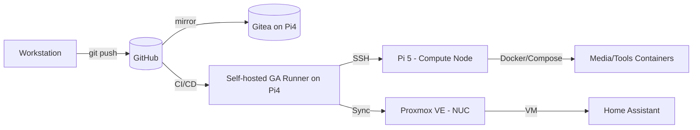

# 🏠 HomeLab Infrastructure

> "The cloud is just someone else's computer." - Welcome to **my** computer.

## 📖 About
This repository hosts the **Infrastructure as Code (IaC)** configuration for my personal HomeLab. The project aims to achieve data sovereignty, practice DevOps workflows (CI/CD), and manage Smart Home services efficiently.

### Workflow & Architecture
This lab operates on a **Hybrid GitOps** model:
1. **Source of Truth:** Code is version-controlled on **GitHub**.
2. **Backup Strategy:** Automated mirroring to a self-hosted **Gitea** instance (running on Raspberry Pi 4).
3. **Deployment:** Continuous Deployment (CD) via self-hosted **GitHub Actions Runners** executing directly on physical nodes.

#### High-level topology (WIP)

### Repository Structure (planned)
- `infra/` — Proxmox, network, DNS, backup IaC (Terraform/Ansible, future)
- `services/` — Docker Compose stacks (media, tools, dashboards)
- `runner/` — Self-hosted GitHub Actions runner setup scripts
- `scripts/` — Bootstrap and maintenance helpers (backup, mirror sync)
- `docs/` — Runbooks, architecture notes, incident log

## 🏗️ Hardware Inventory

| Device             | Role                | Specs             | OS             | Primary Services                        |
| :----------------- | :------------------ | :---------------- | :------------- | :-------------------------------------- |
| **Intel NUC**      | Virtualization Host | Core i5, 8GB RAM  | Proxmox VE     | HAOS (VM), Windows (VM)                 |
| **Raspberry Pi 5** | Compute Node        | 4GB RAM           | Ubuntu Server  | Production Containers (Media, Tools)    |
| **Raspberry Pi 4** | Management Node     | 4GB RAM           | Ubuntu Server  | Gitea, **GitHub Runner**, Reverse Proxy |
| **Raspberry Pi 3** | Management Node     | 1GB RAM           | Ubuntu Server  | Gitea, **GitHub Runner**, Reverse Proxy |
| **PC Desktop**     | Workstation         | Core i5, 16GB RAM | Ubuntu / Win10 | Development, AI Training, Staging       |

## 🚀 Roadmap
### Phase 1: Foundation 🚧
- [x] Initialize `homelab` repository on GitHub.
- [ ] Configure **SSH key pairs** for passwordless ops between nodes (Pi4, Pi5, NUC).
- [ ] Deploy **Gitea** on Raspberry Pi 4 (Docker Compose).
- [ ] Setup **repo mirroring** (GitHub -> Gitea) + scheduled sync.

### Phase 2: Automation Pipelines ⚙️
- [ ] Provision **GitHub Actions self-hosted runner** on Raspberry Pi 4.
- [ ] Add `deploy.yml`:
  - [ ] Trigger on push to `main`.
  - [ ] SSH to Pi5 via runner, pull repo, run `docker compose` updates.
  - [ ] Post-deploy smoke check (container health or HTTP 200).

### Phase 3: Migration & Standardization 📦
- [ ] Audit existing containers on Pi5.
- [ ] Convert ad-hoc `docker run` to `docker-compose.yml` under `services/`.
- [ ] Add env/secret handling (`.env` template + sops/age for secrets).
- [ ] Version Home Assistant configuration (sensitive data excluded/encrypted).

### Phase 4: Monitoring & Security 🛡️
- [ ] Deploy **Uptime Kuma** to watch critical services.
- [ ] Centralized dashboard (Homepage/Heimdall) with links/status.
- [ ] Alerts to Telegram/Discord for build failures and health checks.
- [ ] Baseline hardening: SSH config, fail2ban/ufw, periodic backup verify.

### Phase 5: Observability (stretch) 📊
- [ ] Metrics/logs pipeline (Prometheus/Grafana or lightweight alternative).
- [ ] Long-term retention for key logs/metrics on cheap storage.

## 🚦 Getting Started (WIP)
Prereqs: Docker & Docker Compose on target nodes, SSH access, GitHub PAT (for mirror), age keypair (if using sops).

Suggested flow:
1) Clone: `git clone https://github.com/<you>/homelab`
2) SSH keys: generate and distribute to Pi4/Pi5/NUC; restrict to commands if needed.
3) Gitea: deploy `services/gitea/docker-compose.yml` (once added), configure mirror from GitHub.
4) Runner: bootstrap `runner/` script to register self-hosted runner with repo org.
5) Deploy stacks: `docker compose -f services/<stack>/docker-compose.yml up -d`

## 🔒 Security & Secrets
- Store CI secrets in GitHub Actions secrets; avoid committing plaintext.
- Prefer **sops + age** for encrypting `.env` / YAML values in Git.
- Limit SSH access; consider command/host restrictions for deploy keys.
- Backup strategy: Gitea mirror + Proxmox snapshots + offsite/USB copy (planned).

## 📡 Monitoring & Alerting
- Uptime Kuma for HTTP/TCP checks and alerts (Telegram/Discord).
- Add simple smoke tests post-deploy in CI to fail fast.
- Optional: Prometheus/Grafana stack for metrics if resources allow.

## 🛠️ Tech Stack

* **Virtualization:** Proxmox VE
* **Containerization:** Docker, Docker Compose
* **CI/CD:** GitHub Actions (Self-hosted Runner)
* **SCM:** GitHub (Primary), Gitea (Backup Mirror)
* **OS:** Ubuntu Server LTS, Home Assistant OS

---
*Maintained by [NguyenVanPhuc]*
