# 🏠 HomeLab Infrastructure


> "The cloud is just someone else's computer." - Welcome to **my** computer.

## 📖 About

This repository hosts the **Infrastructure as Code (IaC)** configuration for my personal HomeLab. The project aims to achieve data sovereignty, practice DevOps workflows (CI/CD), and manage Smart Home services efficiently.

### Workflow & Architecture

```mermaid
%%{init: {'theme': 'base', 'themeVariables': { 'primaryColor': '#ffcc00', 'edgeLabelBackground':'#ffffff', 'tertiaryColor': '#f4f4f4'}}}%%
graph TD
    subgraph UserLayer [💻 USER DEVICES]
        User([📱 Mobile / 💻 Laptop])
    end

    subgraph NetworkLayer [🌐 NETWORK]
        CF(☁️ Cloudflare)
        WG(🛡️ WireGuard)
        PiHole(🚫 Pi-hole)
    end

    subgraph ComputeLayer [⚙️ COMPUTE NODES]
        direction TB
        subgraph Pi4 [🍓 Pi model 4]
            Gitea(😸 Gitea)
            Runner(🐙 Runner)
            Vault(🔐 Vault)
        end
        
        subgraph Pi5 [🍓 Pi model 5]
            Plex(🎬 Plex)
            Immich(📷 Immich)
        end

        subgraph NUC [🖥️ Intel NUC]
            HA(🏠 Home Assistant)
        end
    end

    User ==> CF
    User ==> WG
    
    CF --> Pi4
    CF --> Pi5
    CF --> NUC
    
    WG --> PiHole
    PiHole -.-> Pi4
    PiHole -.-> Pi5
    PiHole -.-> NUC

    classDef primary fill:#2496ED,stroke:#fff,stroke-width:2px,color:#fff;
    classDef secondary fill:#32936F,stroke:#fff,stroke-width:2px,color:#fff;
    classDef user fill:#6f42c1,stroke:#fff,stroke-width:2px,color:#fff;

    class Pi4,Pi5,NUC primary;
    class Gitea,Runner,Vault,Plex,Immich,HA secondary;
    class User user;
```



This lab operates on a **Hybrid GitOps** model:
1. **Source of Truth:** Code is version-controlled on **GitHub**.
2. **Backup Strategy:** Automated mirroring to a self-hosted **Gitea** instance (running on Raspberry Pi 4).
3. **Deployment:** Continuous Deployment (CD) via self-hosted **GitHub Actions Runners** executing directly on physical nodes.

#### High-level topology (WIP)


### Repository Structure
This project follows a **[Modular Architecture](docs/en/ARCHITECTURE.md)** (Xem [Tiếng Việt](docs/vi/ARCHITECTURE.md)).

- `services/` — **Reusable Service Definitions** (Docker Compose modules).
- `servers/` — **Deployment Configurations** (Environment-specific).
- `infra/` — Proxmox, network, DNS IaC (Terraform/Ansible, future).
- `scripts/` — Bootstrap and maintenance helpers.
- `docs/` — Documentation.

## 🏗️ Hardware Inventory

| Device             | Role                | Specs             | OS             | Primary Services                        |
| :----------------- | :------------------ | :---------------- | :------------- | :-------------------------------------- |
| **Intel NUC**      | Virtualization Host | Core i5, 8GB RAM  | Proxmox VE     | HAOS (VM), Windows (VM)                 |
| **Raspberry Pi 5** | Compute Node        | 4GB RAM           | Ubuntu Server  | Production Containers (Media, Tools)    |
| **Raspberry Pi 4** | Management Node     | 4GB RAM           | Ubuntu Server  | Gitea, **GitHub Runner**, Reverse Proxy |
| **Raspberry Pi 3** | Management Node     | 1GB RAM           | Ubuntu Server  | Gitea, **GitHub Runner**, Reverse Proxy |
| **PC Desktop**     | Workstation         | Core i5, 16GB RAM | Ubuntu / Win10 | Development, AI Training, Staging       |

## 🗺️ Roadmap


### 🏗️ Infrastructure & Foundation

| Status | High-level Goals | Implementation Notes | ETA |
| :---: | :--- | :--- | :---: |
| ✅ | **Project Init** | GitHub Repo, Directory Structure, Makefile | Q4 2024 |
| ✅ | **SSH Config** | Passwordless setup for Pi4, Pi5, NUC | Q4 2024 |
| ✅ | **Gitea Service** | `services/gitea`, deployed on Raspberry Pi 4 | Q4 2024 |
| 🚧 | **Automation** | GitHub Actions Self-Hosted Runner | Q1 2025 |
| 🚧 | **Woodpecker CI** | CI/CD Pipelines for Gitea (Internal) | Q1 2025 |
| 📅 | **Backup** | Repo mirroring (GitHub <-> Gitea) | Q1 2025 |
| ✅ | **Connectivity** | Cloudflare DNS + Tunnel (Zero Trust) | Q4 2024 |

### 🛠️ Services & Applications

| Status | Service | Purpose | Host |
| :---: | :--- | :--- | :--- |
| 🚧 | **Pi-hole / AdGuard** | DNS Sinkhole & DHCP | Pi4 |
| 📅 | **OpenMediaVault** | NAS & Storage Management | OVM |
| 📅 | **Home Assistant** | Smart Home Core (Migration) | NUC |
| 📅 | **Plex / Jellyfin** | Media Server | Pi5 |
| 📅 | **Immich** | Self-hosted Google Photos alternative | OVM |
| 📅 | **Vaultwarden** | Password Manager | Pi4 |

### 🛡️ Security & Observability

| Status | Feature | Notes |
| :---: | :--- | :--- |
| 📅 | **Monitoring Stack** | Uptime Kuma, Grafana, Prometheus, Loki |
| 📅 | **Secrets Management** | Integrating `sops` + `age` for .env encryption |
| 📅 | **Reverse Proxy** | Nginx Proxy Manager / Caddy with Auto-SSL |
| 📅 | **VPN / Remote Access** | Tailscale or WireGuard |

**Legend:** ✅ Done | 🚧 In Progress | 📅 Planned | ⏸️ On Hold

- [ ] Long-term retention for key logs/metrics on cheap storage.

## 🚦 Getting Started

### Development (MacBook/Local)

**Prerequisites:**
- Docker Desktop (Mac) or Docker Engine
- Git

**Workflow:**
1. **Clone repository:**
   ```bash
   git clone https://github.com/<you>/homelab
   cd homelab
   ```

2. **Validate compose files** (before committing):
   ```bash
   make validate-compose  # Validates syntax on any platform
   ```

3. **Test deployment** (optional, with platform emulation):
   ```bash
   cd servers/raspi5
   make dry-run        # Preview what would be deployed
   make test-deploy    # Actually deploy (ARM64 emulation on Mac)
   make logs           # Check logs
   make test-down      # Clean up
   ```

4. **Run linters:**
   ```bash
   make lint  # Markdown + YAML linting
   ```

5. **Full validation:**
   ```bash
   make test  # Runs all checks
   ```

**Note:** 
- Validation works cross-platform - checks syntax without needing matching architecture
- Test deploy uses Docker platform emulation - you can test ARM64 compose files on Intel/Apple Silicon Macs
- See [`servers/README.md`](servers/README.md) for detailed testing workflow

### Deployment (Servers)

**Prerequisites:** Docker & Docker Compose on target nodes, SSH access, GitHub PAT (for mirror), age keypair (if using sops).

**Suggested flow:**
1. **SSH keys:** Generate and distribute to Pi4/Pi5/NUC; restrict to commands if needed.
2. **Environment setup:** Copy `env.example` to `.env` on each server, fill in values.
3. **Gitea:** Deploy `services/gitea/docker-compose.yml` (once added), configure mirror from GitHub.
4. **Runner:** Bootstrap `runner/` script to register self-hosted runner with repo org.
5. **Interactive Deploy:** Run `make deploy` from root and select the target server.

### 🛠️ Management & Maintenance

We provide an interactive CLI for common operations from the project root:

| Command | Description |
| :--- | :--- |
| `make deploy` | **Deploy** stack to a selected server. |
| `make down` | **Stop & Remove** stack from a selected server. |
| `make config` | **View** final rendered docker-compose config. |
| `make prune` | **Clean up** unused (dangling) images. |
| `make clean-images` | **Deep Clean**: Remove all stack images (requires re-download). |

### 🔒 Security

*   Use **SSH Keys** only (Password auth disabled).
*   Run containers with non-root users (`PUID=1000`, `PGID=1000`) where possible.
*   **Secrets Management:** Do not commit `.env` files. Use `env.example` templates.
*   Keep `make validate` green before pushing.

### 🎥 Demo (Optional)

*Placeholder for GIFs/Screenshots of diagrams or terminal usage.*

## 🤝 Contributing

1.  Fork the repo.
2.  Create a feature branch (`git checkout -b feature/amazing-feature`).
3.  Commit changes (`git commit -m 'Add amazing feature'`).
4.  Push to branch (`git push origin feature/amazing-feature`).
5.  Open a Pull Request.

## 📜 License

Distributed under the MIT License. See `LICENSE` for more information.


## 🔒 Security & Secrets
- Store CI secrets in GitHub Actions secrets; avoid committing plaintext.
- Prefer **sops + age** for encrypting `.env` / YAML values in Git.
- Limit SSH access; consider command/host restrictions for deploy keys.
- Backup strategy: Gitea mirror + Proxmox snapshots + offsite/USB copy (planned).

## 📡 Monitoring & Alerting
- Uptime Kuma for HTTP/TCP checks and alerts (Telegram/Discord).
- Add simple smoke tests post-deploy in CI to fail fast.
- Optional: Prometheus/Grafana stack for metrics if resources allow.

## 🛠️ Tech Stack

| Domain | Technologies |
| :--- | :--- |
| **Infrastructure** |    |
| **CI/CD & GitOps** |    |
| **Networking** |    |
| **Observability** |    |

---
*Maintained by [NguyenVanPhuc]*
